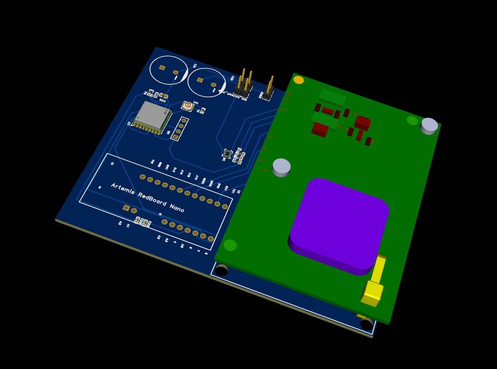

# OpenMetBuoy Nano 2024

A version of the [OpenMetBuoy 2021](https://github.com/jerabaul29/OpenMetBuoy-v2021a) based on the [Rockblock 9603 modem](https://www.groundcontrol.com/product/rockblock-9603-satellite-modem/).

* [Hardware](https://github.com/gauteh/omb-nano/issues/6)

## Peripherals

- IMU: IOM0
- Iridium: UART1
- GPS: IOM3
- D10: indicator LED.
